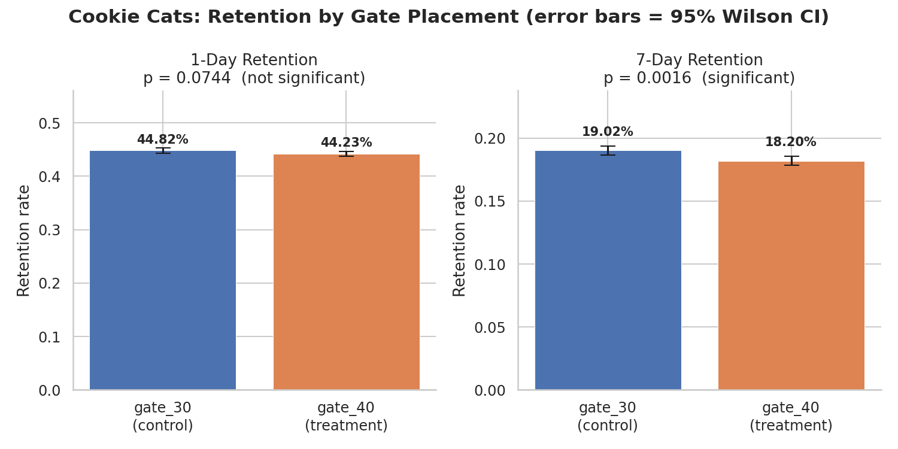
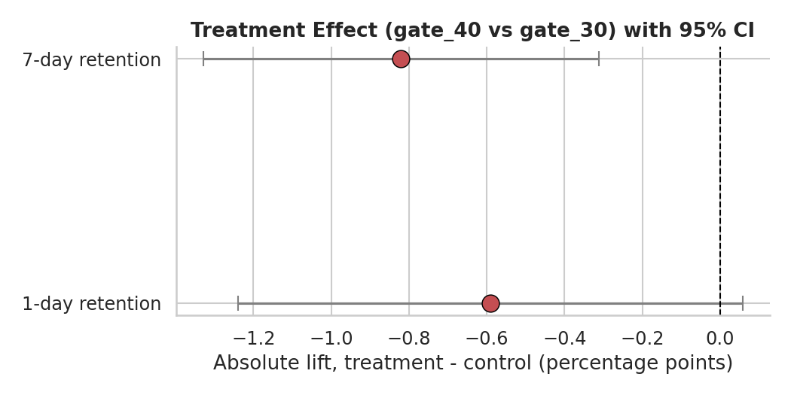

# A/B Test Analysis & Experimentation Framework

End-to-end analysis of a real product experiment: a reusable statistical
toolkit for power analysis and hypothesis testing, applied to a real
90,189-player A/B test from the mobile game **Cookie Cats**.

## The experiment

Cookie Cats is a mobile puzzle game. As players progress they hit "gates"
that pause them until a timer expires or they pay to continue. This
experiment tested moving the **first gate from level 30 to level 40**:

- **Control** (`gate_30`, n = 44,700): gate stays at level 30 (original)
- **Treatment** (`gate_40`, n = 45,489): gate moved to level 40

Players were randomly assigned on install. For each player we observe
`sum_gamerounds` (rounds played in 14 days), `retention_1` (returned after
1 day), and `retention_7` (returned after 7 days).

**Business question:** does delaying the gate help or hurt retention?

## Dataset

[`data/cookie_cats.csv`](data/cookie_cats.csv) — 90,189 rows, no missing
values, no duplicate user IDs. Source: [Mobile Games A/B Testing with
Cookie Cats](https://github.com/ryanschaub/Mobile-Games-A-B-Testing-with-Cookie-Cats)
(originally published as a DataCamp project dataset).

## What this project demonstrates

1. **Power analysis** — computes the sample size required to detect a
   1-percentage-point lift in retention at 80% power before trusting any
   result (`src/experiment_framework.py::required_sample_size`), using
   Cohen's h so the calculation is valid at any baseline rate, not just
   near 50%.
2. **Sample Ratio Mismatch (SRM) check** — a chi-square goodness-of-fit
   test on the observed group sizes, using the strict p < 0.0001 threshold
   used by production experimentation platforms (a plain p < 0.05 test
   would flag most large-sample experiments as broken from noise alone).
3. **Two-proportion z-tests** on both retention metrics, with Wald 95%
   confidence intervals on the absolute *and* relative lift, and Cohen's h
   effect size.
4. **A secondary continuous metric** (game rounds played) analyzed with
   Welch's t-test and a percentile bootstrap CI, after documenting and
   trimming an extreme outlier (one player logged ~49,854 rounds).
5. **Visualization**: retention-by-group bar charts with confidence
   intervals, a forest plot of the treatment effect, a power curve, and an
   engagement distribution plot.

## Results

| Metric | Control | Treatment | Abs. Lift | 95% CI | Rel. Lift | p-value | Significant (α=0.05)? |
|---|---|---|---|---|---|---|---|
| 1-day retention | 44.82% | 44.23% | -0.59pp | [-1.24pp, +0.06pp] | -1.32% | 0.074 | No |
| 7-day retention | 19.02% | 18.20% | -0.82pp | [-1.33pp, -0.31pp] | -4.31% | **0.0016** | **Yes** |
| Game rounds played | 50.09 | 49.81 | -0.28 | [-1.52, +0.93] | — | 0.647 | No |

**Recommendation: do not ship `gate_40` — keep the gate at level 30.**
Both retention metrics point the same (negative) direction for the
treatment, and the effect is statistically significant on the more
decision-relevant 7-day horizon. Since game engagement itself doesn't
differ between groups, the retention drop reflects players churning
outright rather than simply playing less before leaving. Full narrative
and every number behind this call: [`results/results.md`](results/results.md).




## Project structure

```
abtest_project/
├── data/
│   └── cookie_cats.csv              # raw dataset (90,189 rows)
├── notebooks/
│   └── ab_test_analysis.ipynb       # narrative walkthrough, pre-run with outputs
├── src/
│   ├── experiment_framework.py      # reusable power analysis / SRM / z-test / bootstrap toolkit
│   └── run_analysis.py              # analysis pipeline: loads data, runs every test, saves figures
├── results/
│   ├── fig1_retention_by_group.png
│   ├── fig2_lift_forest_plot.png
│   ├── fig3_power_curve.png
│   ├── fig4_gamerounds_distribution.png
│   ├── metrics.json                 # machine-readable results
│   └── results.md                   # human-readable full report
└── README.md
```

## How to reproduce

```bash
pip install pandas numpy scipy statsmodels matplotlib seaborn
python src/run_analysis.py
```

This regenerates every figure and `results/metrics.json` from the raw CSV.
Or open `notebooks/ab_test_analysis.ipynb` for the narrated walkthrough.

## Methods reference

- **Sample size / power**: `statsmodels.stats.power.NormalIndPower`, effect
  size via Cohen's h (arcsine-transformed proportions).
- **Hypothesis test**: `statsmodels.stats.proportion.proportions_ztest`
  (pooled-variance two-proportion z-test), Wald confidence interval on the
  unpooled difference in proportions.
- **SRM check**: `scipy.stats.chisquare` goodness-of-fit test.
- **Continuous metric**: Welch's t-test (`scipy.stats.ttest_ind`,
  `equal_var=False`) plus a 10,000-iteration percentile bootstrap for a
  distribution-free CI on the difference in means.

## Extending this framework

`src/experiment_framework.py` is written to be dataset-agnostic — every
function takes counts/rates, not this specific dataframe — so it can be
pointed at any binary-outcome A/B test (conversion, click-through,
sign-up, retention) by swapping in a different `pd.read_csv` and column
names in `run_analysis.py`.
